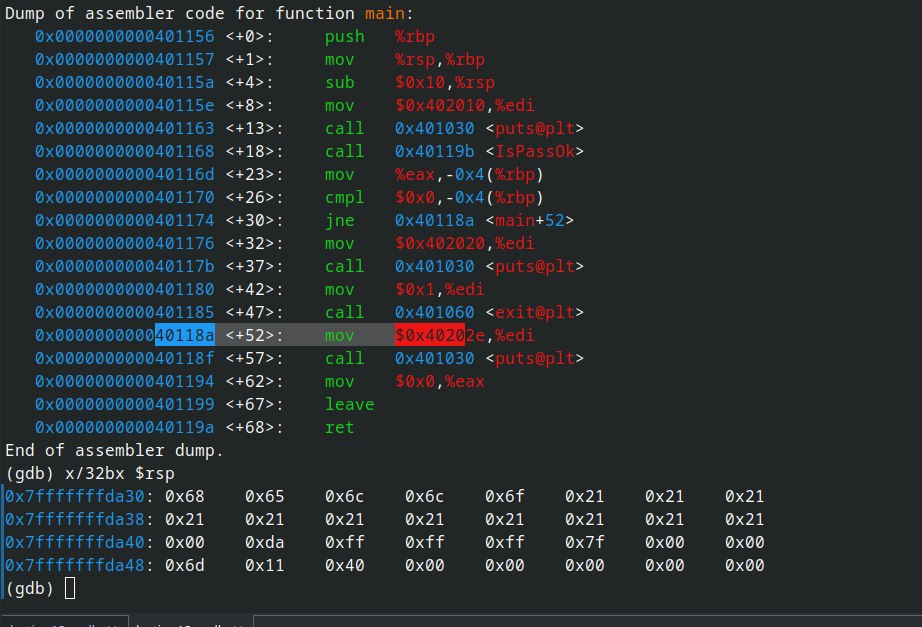
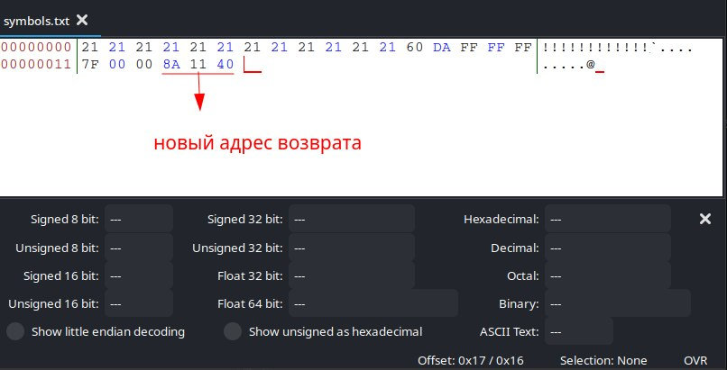
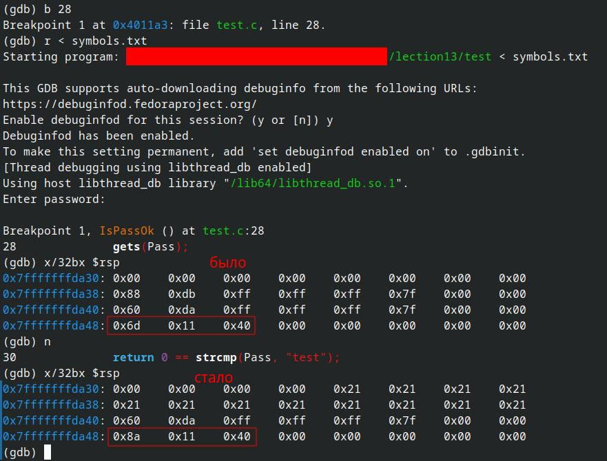
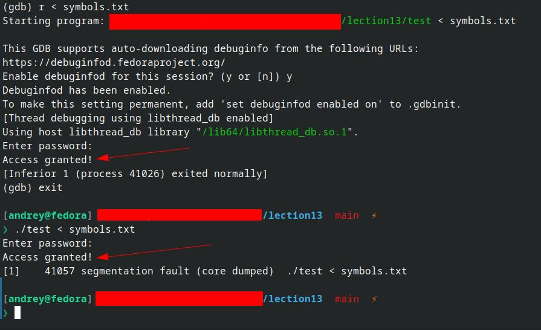

# Переполнение стека

## Исходная программа

```
#include <stdio.h>
#include <string.h>
#include <stdlib.h>

int IsPassOk(void);

int main(void)
{
	int PwStatus;

	puts("Enter password:");
	PwStatus = IsPassOk();
	
	if (PwStatus == 0) {
		printf("Bad password!\n");
		exit(1);
	} else {
		printf("Access granted!\n");
	}

	return 0;
}

int IsPassOk(void)
{
    char Pass[12];

	gets(Pass);

	return 0 == strcmp(Pass, "test");
}

```

Компилляция программы была выполена со следующими параметрами:

`gcc test.c -no-pie -fno-stack-protector -g`

## Обход проверки "пароля"



Необходимо поменять адрес возврата с `0x40116d` на `0x40118a` для обхода проверки пароля.


В текстовый файл с помощью Hex редактора добавлены следующие коды символов:



В stdin скопмилированной программы направили содержимое созданного текстового файла:

`./test < symbols.txt`



## Результат

В итоге, мы пропустили часть машинных инструкций (cmp, jne и т.д.) для валидации пароля.



